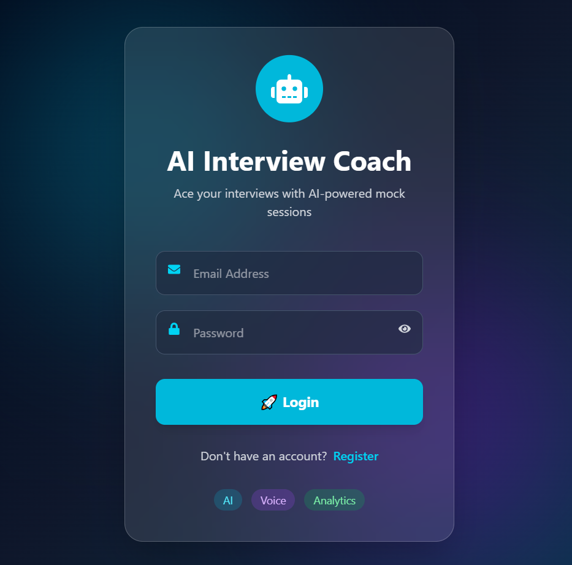
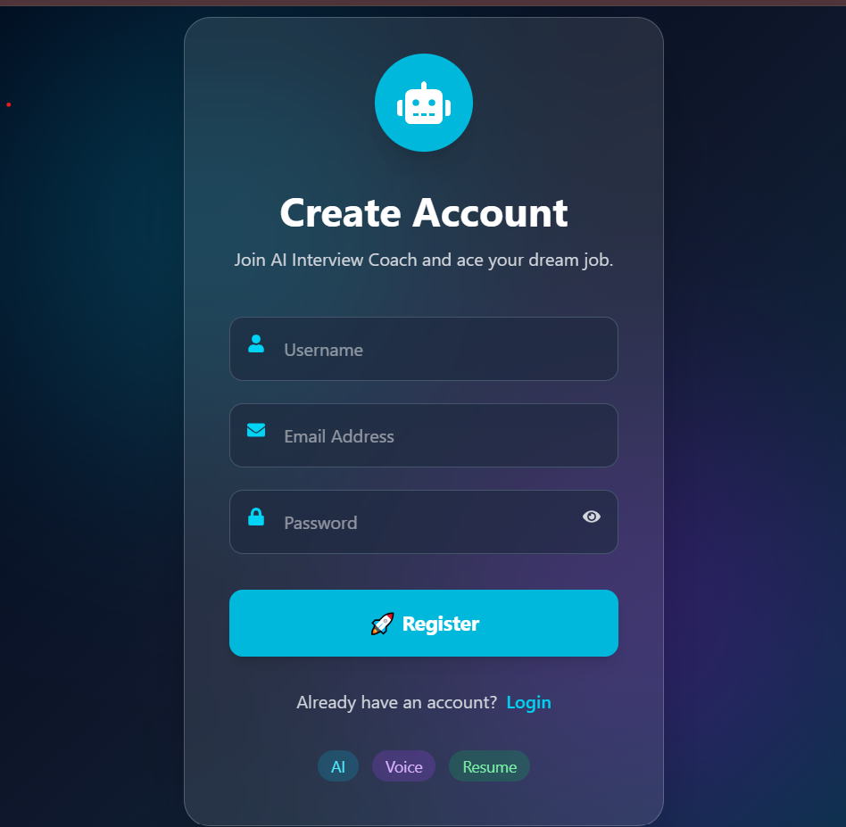
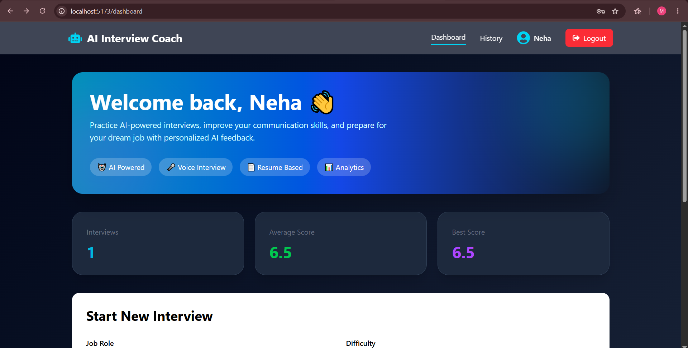
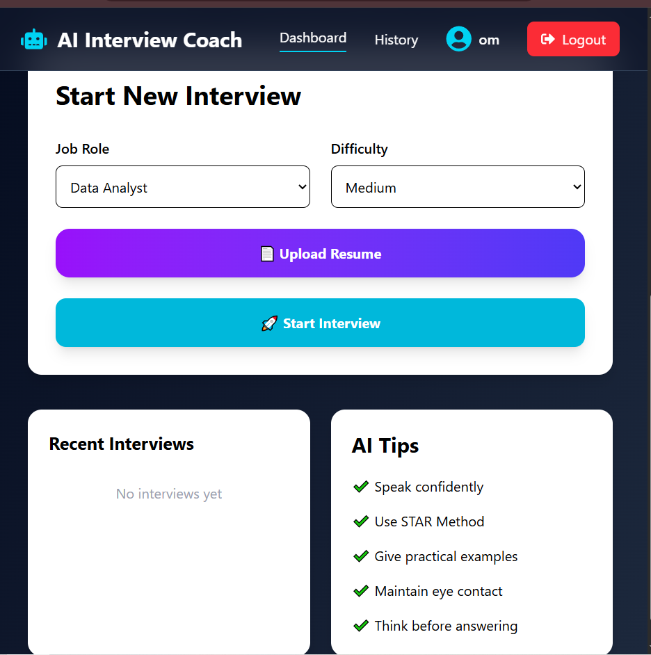
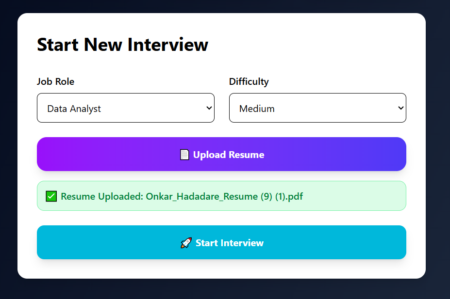
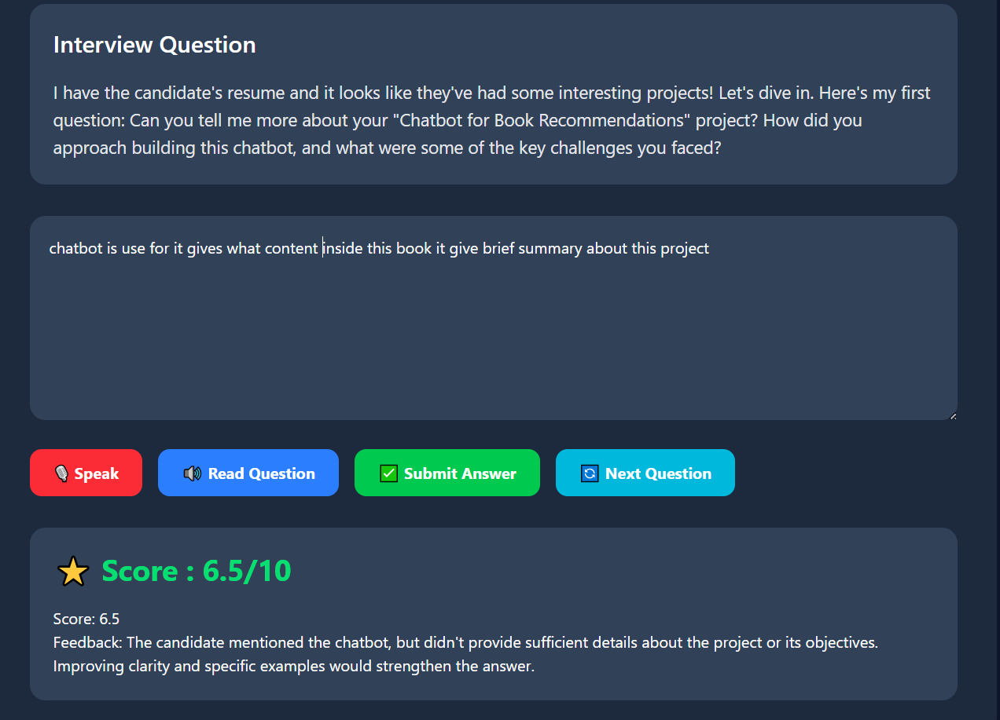
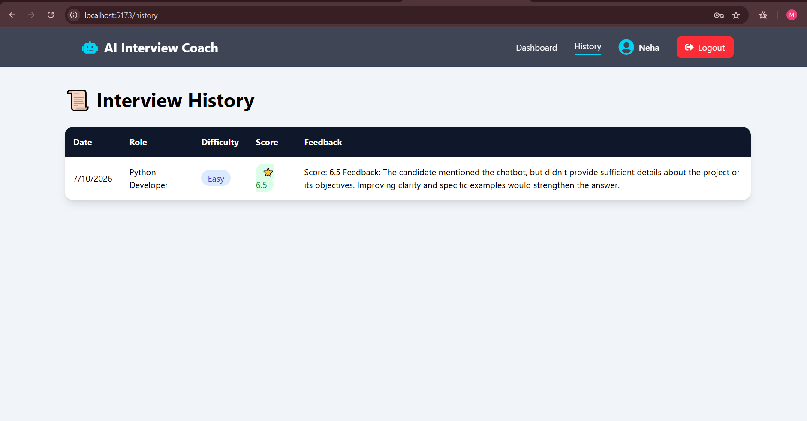

# 🤖 InterviewIQ – AI-Powered Mock Interview Platform

<p align="center">
  
  
  
  
  
  
</p>

---

## 📌 Overview

InterviewIQ is an AI-powered mock interview platform designed to help students and job seekers prepare for technical interviews.

The platform generates AI-based interview questions according to the selected job role and difficulty level, evaluates candidate answers using an LLM, provides scores with personalized feedback, supports resume-based interviews, voice interaction, and tracks interview performance over time.

---

# ✨ Features

- 🔐 Secure User Registration & Login
- 👤 Personalized Dashboard
- 📄 Resume Upload & Parsing
- 🤖 AI Generated Interview Questions
- 🎯 Role-Based Interview Preparation
- 📊 Difficulty Levels (Easy, Medium, Hard)
- 🎤 Speech-to-Text Answer Input
- 🔊 Text-to-Speech Question Reading
- ⭐ AI Answer Evaluation
- 💬 Instant AI Feedback
- 📈 Dashboard Statistics
- 📜 Interview History
- 🧠 Resume-based Question Generation

---

# 🛠 Tech Stack

## Frontend

- React.js
- Vite
- Tailwind CSS
- React Router
- Axios
- Web Speech API

## Backend

- FastAPI
- Python
- SQLAlchemy
- SQLite
- Pydantic

## AI

- Ollama
- Llama 3

---

# 📂 Project Structure

```
InterviewIQ
│
├── backend
│   ├── app
│   ├── uploads
│   ├── requirements.txt
│   └── interview.db (Ignored)
│
├── frontend
│   ├── src
│   ├── public
│   ├── package.json
│   └── vite.config.js
│
├── .gitignore
└── README.md
```

---

# 🚀 Installation

## Clone Repository

```bash
git clone https://github.com/Maithili91/InterviewIQ.git
```

---

## Backend Setup

```bash
cd backend

python -m venv venv

venv\Scripts\activate

pip install -r requirements.txt

uvicorn app.main:app --reload
```

Backend will run on:

```
http://127.0.0.1:8000
```

---

## Frontend Setup

```bash
cd frontend

npm install

npm run dev
```

Frontend will run on:

```
http://localhost:5173
```

---

# 📸 Application Screenshots

## 🔐 Login Page
 

---

## 📝 Register Page



---

## 🏠 Dashboard



 

---

## 📄 Resume Upload
 

---

## 🤖 AI Interview



---
 

## 📜 Interview History



---

# 🎯 Workflow

```
User Login
      │
      ▼
Dashboard
      │
      ▼
Upload Resume
      │
      ▼
Select Role & Difficulty
      │
      ▼
AI Generates Question
      │
      ▼
User Types/Speaks Answer
      │
      ▼
LLM Evaluates Answer
      │
      ▼
Score + Feedback
      │
      ▼
History Saved
```

---

# 💡 Future Enhancements

- 🌍 Online Deployment
- 📊 Performance Analytics Graphs
- 📄 PDF Interview Report
- 📧 Email Report
- 🎥 Video Interview Support
- 🤖 Multiple AI Models
- 🌐 Multi-language Support

---

# 👨‍💻 Author

**Maithili Bharat Hadadare**

📍 Maharashtra

GitHub

https://github.com/Maithili91

LinkedIn

 https://www.linkedin.com/in/maithili-hadadare-537832339/

---

# ⭐ Support

If you found this project useful, consider giving it a ⭐ on GitHub.

It motivates me to build more amazing AI projects.

---

# 📜 License

This project is developed for learning and portfolio purposes.